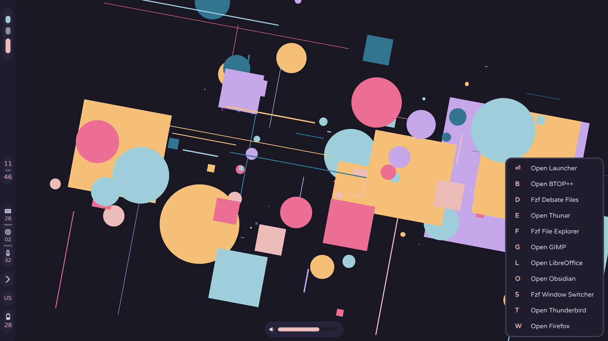

# Rosé-Shell
## Overview

This is Rosé-Shell the a Quickshell desktop for Niri made for the Rosé-Pine color scheme. 
## Features
- **Features Include**
	- Sidebar
		- Niri Workspace Widget with support for permanent workspaces
		- Clock
		- System Monitor
			- Memory Usage
			- CPU Usage
			- Temperature
		- System Tray
		- Language Indicator/Switcher
		- Battery Monitor
	- OSD
		- Audio
			- Shows mute and volume level
		- Brightness
			- Shows screen brightness level
	- Notifications
		- Headers
		- Body Text
		- Images
		- Actions
		- Click Anywhere to Close
	- Key Chords
		- Somewhat janky keychords with Niri
		- Opens a window that pulls focus, and closes on next key
		- Chords Menus
			- Applications
			- Power Menu

