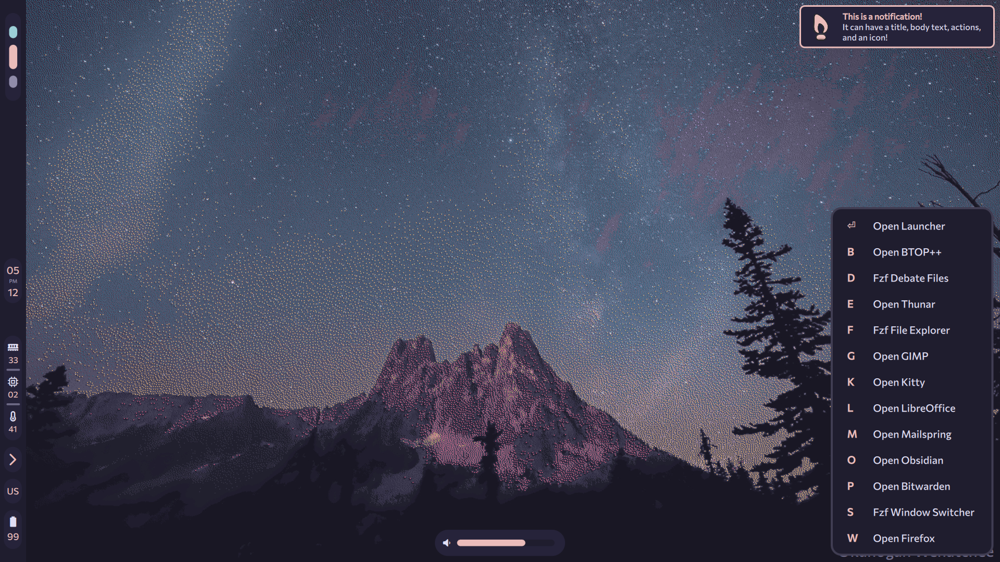
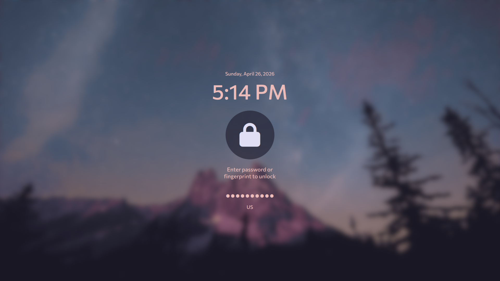

# Rosé-Shell
## Overview

This is Rosé-Shell a Quickshell desktop for [Niri](https://github.com/niri-wm/niri) made for the Rosé-Pine color scheme. 
## Features
- **Features Include**
	- Sidebar
		- Niri Workspace Widget with support for permanent workspaces
		- Clock
		- System Monitor
			- Memory Usage
			- CPU Usage
			- Temperature
		- System Tray
		- Language Indicator/Switcher
		- Battery Monitor
		- Toggleable Idle Inhibitor
			- Notifies when on to prevent accidental usage.
	- OSD
		- Audio
			- Shows mute and volume level
		- Brightness
			- Shows screen brightness level
	- Notifications
		- Headers
		- Body Text
		- Images
		- Actions
		- Click Anywhere to Close
	- Key Chords
		- Somewhat janky keychords with Niri
		- Opens a window that pulls focus, and closes on next key
		- Chords Menus
			- Applications
			- Power Menu
	- Overlay Label
		- Label on Lockscreen with Wallpaper Title
	- Lockscreen
		- Background Mirrors Wallpaper
		- Animations
			- Typing Animation
			- Unlock Animation
			- Authentication Failed Animation
		- Authentication
			- Password
				- Keyboard language indicator
			- Fingerprint
				- Up to 3 attempts of pam_fprintd.so
		- Built-In Idle Daemon
			- Dims Screen
			- Locks Screen
			- Turns off Screen
